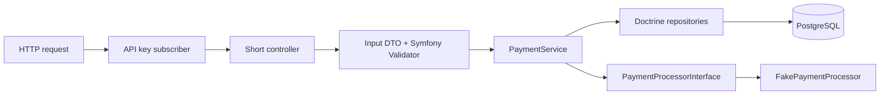

# Architecture

## Single Responsibility

Controllers adapt HTTP to application calls and set status codes. `InputValidator` handles JSON shape, types and Symfony constraint violations. Entities describe persisted data. Repositories query it. `PaymentService` owns creation and replay rules. `ErrorSubscriber` consistently translates exceptions into sanitized JSON.

## Dependency Inversion

`PaymentService` depends on `PaymentProcessorInterface`, not the fake implementation. Symfony injects `FakePaymentProcessor` through an alias. The fake is deterministic and has no external side effects, making the workflow easy to test. Replacing it with a real gateway would require an outbox/transaction strategy and provider idempotency; changing the binding alone is not sufficient for real payments.

## Money

`amount` is an integer number of cents in the DTO, entity, database and responses. Fractional JSON values, numeric strings, booleans and overflow are rejected. A database check also requires a positive amount. EUR, USD and GBP are the intentionally small demo currency set; all use two fractional digits.

## Idempotency

1. Validate the request and key.
2. Find the merchant or return 404.
3. SHA-256 a fixed-order representation of the validated request fields.
4. Look up `(merchant, key)`. Matching hash: 200 and existing payment. Different hash: 409.
5. Otherwise simulate, insert and flush: 201.
6. A unique database index arbitrates concurrent inserts. After a unique violation, Doctrine has rolled back and closed its manager; reset it, read the winner and apply the same replay check.

The key is scoped to a merchant, case-sensitive and 1–128 ASCII letters/digits or `._:-`. There is no expiry. JSON whitespace and object-key order do not matter; validated string values do. Input DTOs reject unknown fields, preventing ignored fields from silently changing meaning. Failed payments obey the same replay rules.

The fake processor is pure, so running it before an insert cannot charge anything twice. This guarantee would not transfer to an external provider. There are no real payment calls here.

## Persistence and errors

UUIDs identify merchants/payments, timestamps are UTC, and foreign keys preserve ownership. Pagination bounds list responses. `ApiException` carries client-safe domain errors; unexpected failures become a generic HTTP 500. The entry point never enables debug. Health is liveness only; it intentionally stays independent of database readiness.

## Security boundary

The shared demo API key protects writes; it does not model merchant identity. Read routes are public. Only fictional merchant details belong in this public demo. No card fields or secrets appear in responses. Production-grade tenant isolation, rate limiting and security monitoring remain future work.

## Verification

PHPUnit exercises the actual Symfony HTTP kernel and Doctrine persistence. Local defaults use a disposable SQLite file; CI runs the same tests against migrated PostgreSQL, including a direct unique-constraint test. This is complemented by live Railway smoke checks; results are recorded in STATUS.md.

## Interactive web demonstration

Twig renders `/demo`; native JavaScript calls only `/demo/payments` and `/demo/history`. `DemoController` handles HTTP/session checks, `DemoPaymentInput` parses constrained decimal strings without floats, and `DemoService` selects a server-owned demo merchant and applies quotas before delegating to the existing `PaymentService`. No copy of the payment/idempotency logic is introduced.

A native session lock serializes writes for one visitor, so the database-backed 10-payment quota is checked inside that lock. Sessions expire after one hour; a fixed one-minute window caps demo requests at 30. CSRF tokens bind actions to the session. The demo code never accesses the API key. API authentication remains unchanged.

The explicit demo flag enables safe age-based cleanup via `app:demo:cleanup` (preview by default, `--execute` for deletion). Limits apply to one session, not to a person; cookie resets bypass them. File sessions suit the current single replica and are not shared across replicas/deployments.
